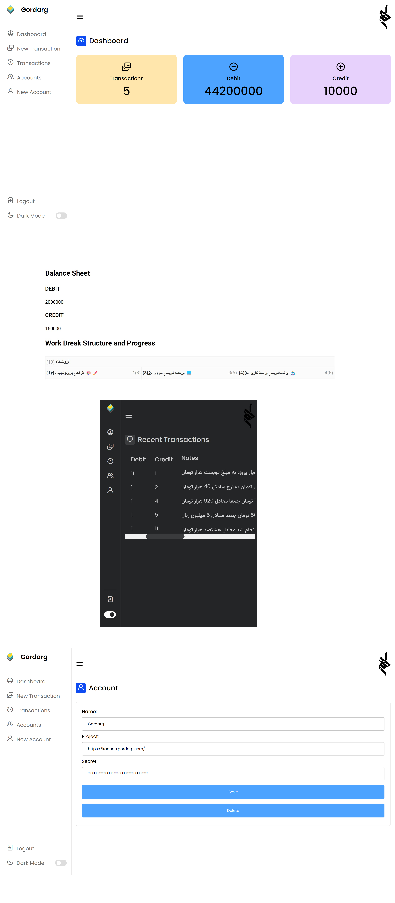

# Home

A simple solution to double entry accounting. I personally keep track of my customers payments and my commitments using this simple tool.
It's based on [php-mvc-blog](https://github.com/tayyebi/php-mvc-blog)

# Screenshots



# Environment Setup

```
sudo apt install php8.1-fpm
sudo a2enconf php8.1-fpm
sudo apt install php8.1-sqlite3
sudo a2enmod rewrite
sudo apt-get install php7.2-xml
```

# Installation

```
docker-compose up -d
```

# Permissions
```
find . -type d -exec sudo chmod 755 {} \;
find . -type f -exec sudo chmod 644 {} \;
sudo chown www-data:www-data -R database/ ;
```
